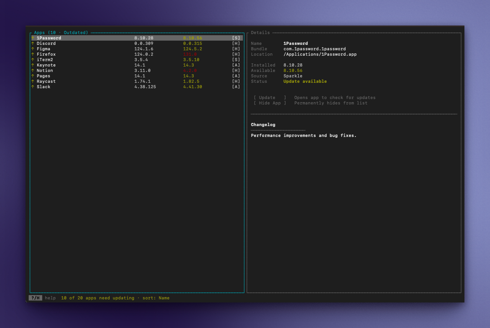
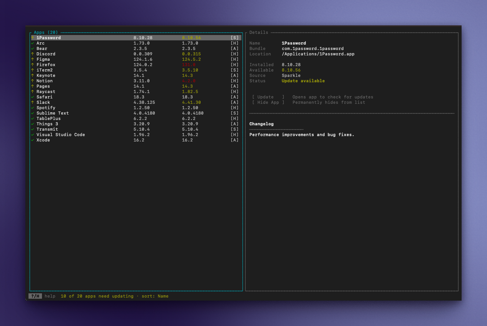

# freshly

A fast, terminal-based update checker for macOS applications.

freshly scans your `/Applications` folder and checks for available updates across multiple sources — App Store, Homebrew Cask, and Sparkle feeds — all from your terminal.

<table>
<tr>
<td><a href="assets/freshly-outdated-v2.png"></a></td>
<td><a href="assets/freshly-all-v2.png"></a></td>
</tr>
<tr>
<td align="center"><em>Outdated apps</em></td>
<td align="center"><em>All apps</em></td>
</tr>
</table>

## Features

- **Three update sources** — checks App Store, Homebrew Cask catalog, and Sparkle appcast feeds concurrently
- **No package manager required** — detects updates for apps installed via DMG, drag-and-drop, or direct download
- **Update apps inline** — run Homebrew upgrades with a live output overlay, open App Store updates, or launch Sparkle apps to self-update
- **Interactive TUI** — browse apps, view changelogs, open apps, hide apps, filter by update status, search by name
- **JSON output** — pipe results to other tools with `--json`
- **Fast** — parallel scanning with async I/O, typically completes in a few seconds

## Installation

### Homebrew

```bash
brew install skydiver/freshly/freshly
```

### Download binary

Download the latest release from the [releases page](https://github.com/skydiver/freshly/releases) (universal binary for Apple Silicon and Intel).

The binary is **code-signed and notarized by Apple**, so it's verified as safe to run. However, browsers add a quarantine attribute to downloaded files that may trigger a Gatekeeper warning. To resolve this, remove the quarantine attribute:

```bash
xattr -d com.apple.quarantine freshly
```

### From source

Requires [Rust](https://www.rust-lang.org/tools/install) 1.75 or later.

```bash
git clone https://github.com/skydiver/freshly.git
cd freshly
cargo install --path .
```

### Build only

```bash
cargo build --release
# Binary at target/release/freshly
```

## Usage

```bash
# Launch the interactive TUI
freshly

# Output as JSON (non-interactive)
freshly --json

# Filter by update source
freshly --source homebrew

# JSON with error details
freshly --json --verbose
```

### Keyboard Controls

| Key                    | Action                                      |
| ---------------------- | ------------------------------------------- |
| `↑` / `↓` or `j` / `k` | Navigate list or detail actions             |
| `Enter`                | List: open detail pane · Detail: run action |
| `Esc`                  | Detail: back to list · Search: cancel       |
| `Tab`                  | Switch between app list and detail pane     |
| `f`                    | Cycle filter: Outdated → All → Up to date   |
| `s`                    | Cycle sort: Name → Source → Status          |
| `/`                    | Search by app name                          |
| `?` / `H`              | Show keyboard shortcuts                     |
| `e`                    | Show scan errors                            |
| `r`                    | Refresh scan                                |
| `PageUp` / `PageDown`  | Scroll by page                              |
| Mouse click            | Switch between list and detail pane         |
| `q`                    | Quit                                        |

### Update Sources

| Tag   | Source    | How it works                                                    |
| ----- | --------- | --------------------------------------------------------------- |
| `[A]` | App Store | Queries the iTunes lookup API for apps with a MAS receipt       |
| `[H]` | Homebrew  | Matches `.app` filenames against the full Homebrew Cask catalog |
| `[S]` | Sparkle   | Fetches appcast XML feeds defined in the app's `Info.plist`     |

## Contributing

Contributions are welcome. Please open an issue to discuss larger changes before submitting a PR.

```bash
# Run tests
cargo test

# Run clippy
cargo clippy -- -D warnings
```

## License

[MIT](LICENSE)
